# Hello, my name is Hunter Roberson.

I am from North Texas.
I’m currently working on getting my associate's degree in Computer Science at Grayson College.
I plan to go to the University of North Texas to pursue my bachelor's degree in Computer Science afterwards.
I’m currently learning C++ and how to webhost.
I aspire to be in the IT workspace and eventually become a system administrator.

